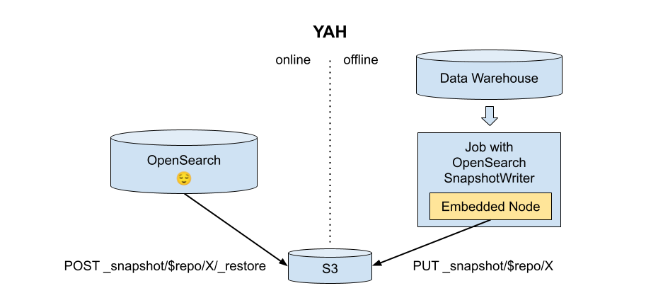
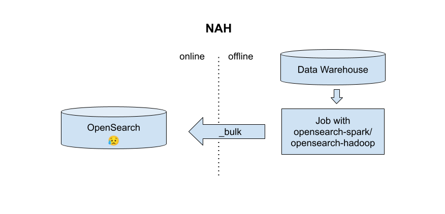
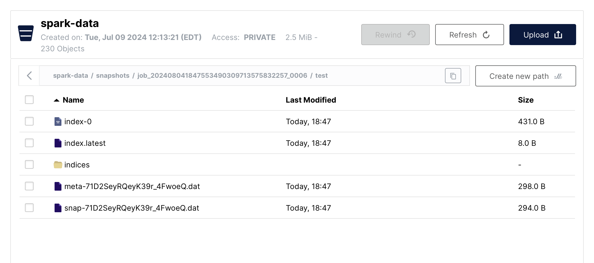

# OpenSearch SnapshotWriter for Spark and MapReduce

The OpenSearch SnapshotWriter is an OutputFormat creates an index as a loadable snapshot, instead of by pushing documents to a live cluster.  Documents are written to embedded, in-jvm, single-node instances of OpenSearch, ingests records, snapshots each shard, then merges the snapshots into a complete index.
The writer leverages [opensearch-runner](https://github.com/codelibs/opensearch-runner), and the [layout of snapshots](https://www.veritas.com/support/en_US/article.100055299) to
produce a sharded index without coordination between the tasks.

In summary:

| Do This | Not This |
| ------- | -------- |
|  |   |


I created this project as a way to familiarize myself with OpenSearch between jobs.  I wrote up my findings as I went along in a [post](https://slackhappy.github.io/spark_loadable_opensearch_snapshots).  This library ties those findings together in a way that is hopefully useful for others.


### OpenSearchOutputFormat Usage (mapreduce)

```java
import io.github.slackhappy.opensearchsnapshotwriter.OpenSearchSnapshotOutputFormat;


// Set the output location, index name, and mappings:
conf.set(OpenSearchSnapshotOutputFormat.OUTPUT_DIR_KEY, "s3a://spark-data/snapshots");
conf.set(OpenSearchSnapshotOutputFormat.RESOURCE_KEY, "test");
conf.set(OpenSearchSnapshotOutputFormat.NUMBER_OF_SHARDS_KEY, "2");

Map<String, Object> fieldsMap = new HashMap<>();
fieldsMap.put("text", Collections.singletonMap("type", "text"));
fieldsMap.put("docid", Collections.singletonMap("type", "long"));
Map<String, Object> mappingsMap = Collections.singletonMap("properties", fieldsMap);
OpenSearchSnapshotOutputFormat.setIndexMapping(conf, mappingsMap);


// In the job, set the partitioner (partitions docs to correct shards) and outputformat (writes the records to snapshots)
Job job = new Job(conf, getClass().getName());

// Add inputs, etc
// OutputFormat expects <Text, BytesWritable> for the string key, and serialized source json.
OpenSearchSnapshotOutputFormat.setOutputFormatClass(job);
job.setPartitionerClass(OpenSearchSnapshotShardPartitioner.class);
```

### SparkRowOpenSearchSnapshotWriter Usage (spark)

```scala
import io.github.slackhappy.opensearchsnapshotwriter._

case class FD (_id: String, docId: Long, title: String, text: String)

val spark = SparkSession.builder.appName("Simple Application").getOrCreate()
val dfData = (1 to 10000).map(id => FD("id" + id, id, "title" + id, "text" + id))
val df = spark.createDataFrame(dfData)
val mapping =
  """
   {"properties":{
      "docId": {"type": "long"},
      "title": {"type": "text"},
      "text": {"type": "text"}
    }}
  """
df.snapshotForOpenSearch("s3a://spark-data/snapshots", "test", mapping, 2)
```


### Loading the snapshot into a live cluster

The jobId and indexName will be added to the end of the specified output dir.



If you configured your job to write to s3, and you have the repository-s3 plugin installed, you could load them from s3, for example.  Here's a local cluster loading the multi-shard snapshot, adapting the standard instructions from [Take and restore snapshots](https://opensearch.org/docs/latest/tuning-your-cluster/availability-and-recovery/snapshots/snapshot-restore/#take-snapshots)

```shell
# add the repo
$ curl -XPUT "http://localhost:9200/_snapshot/my-s3-repository" -H 'Content-Type: application/json' -d'
{
  "type": "s3",
  "settings": {
    "bucket": "spark-data",
    "base_path": "snapshots/job_202408041847553490309713575832257_0006/test"
  }
}'

# restore the snapshot
$ curl -XPOST http://localhost:9200/_snapshot/my-s3-repository/snap/_restor

# test!
$ curl localhost:9200/test/_search
{"took":19,"timed_out":false,"_shards":{"total":2,"successful":2,"skipped":0,"failed":0},"hits":{"total":{"value":10000,"relation":"eq"},"max_score":1.0,"hits":[{"_index":"test","_id":"id2","_score":1.0,"_source":{"docId":2,"text":"text2","title":"title2"}},{"_index":"test","_id":"id3","_score":1.0,"_source":{"docId":3,"text":"text3","title":"title3"}},{"_index":"test","_id":"id7","_score":1.0,"_source":{"docId":7,"text":"text7","title":"title7"}},{"_index":"test","_id":"id14","_score":1.0,"_source":{"docId":14,"text":"text14","title":"title14"}},{"_index":"test","_id":"id15","_score":1.0,"_source":{"docId":15,"text":"text15","title":"title15"}},{"_index":"test","_id":"id17","_score":1.0,"_source":{"docId":17,"text":"text17","title":"title17"}},{"_index":"test","_id":"id19","_score":1.0,"_source":{"docId":19,"text":"text19","title":"title19"}},{"_index":"test","_id":"id20","_score":1.0,"_source":{"docId":20,"text":"text20","title":"title20"}},{"_index":"test","_id":"id21","_score":1.0,"_source":{"docId":21,"text":"text21","title":"title21"}},{"_index":"test","_id":"id22","_score":1.0,"_source":{"docId":22,"text":"text22","title":"title22"}}]}}[spark_to_search (offlinejob *+)] $ curl localhost:9200/test/_mapping
```

This should be compatible with OpenSearch's [Searchable snapshots](https://opensearch.org/docs/latest/tuning-your-cluster/availability-and-recovery/snapshots/searchable_snapshot/) feature, though I haven't tested it.


### Configuration

| Key                           | Value                                            |
|-------------------------------|--------------------------------------------------|
| `opensearch.resource`         | name of index                                    |
| `opensearch.number_of_shards` | number of shards to create                       |
| `opensearch.mapping`          | field type mapping.  All fields must be declared |
| `mapreduce.output.fileoutputformat.outputdir` | Job output, snapshot will be placed in a $jobId/$indexName subdir of this directory |


### Subprojects

- mr: MapReduce, main implementation based on a `<Text, BytesWritable>` OutputFormat. Includes an example jsonl mapper.
- spark3: Spark adaptations, includes an example Row mapper, uses `RDD<String, byte[]>` instead of the MR types.
- example: Spark example. pom.xml might be useful to look at for uberjar and conflict handling.

### Building

I use a java11 `$JAVA_HOME`.  `mvn clean package` in the root.